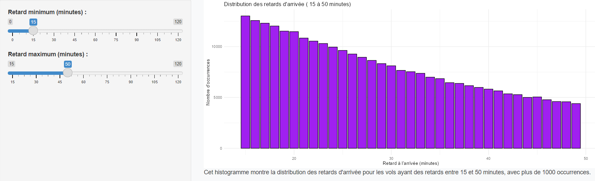
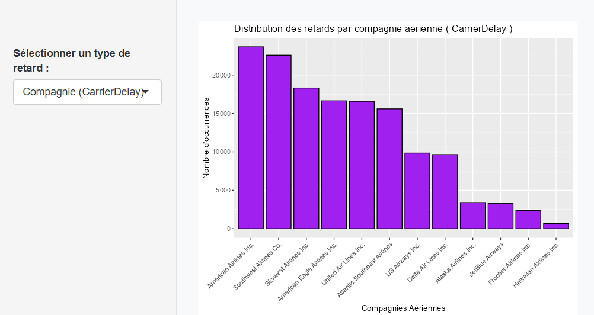
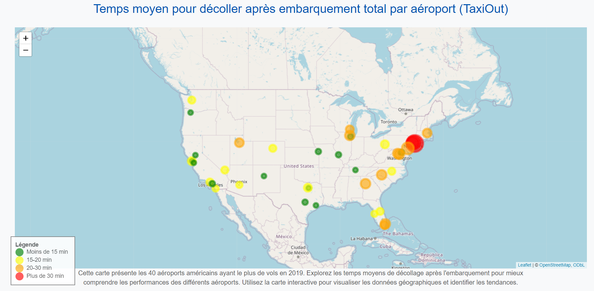

# Dashboard d'Analyse des Retards Aériens

## User Guide
Pour déployer et utiliser ce dashboard sur une autre machine, suivez ces étapes :

1. **Cloner le dépôt** :

   Créer un dossier pour récupérer le projet

   Saisissez dans votre terminal :

         cd cheminaccesdossier
         
         git clone https://git.esiee.fr/viellarl/project_nath_ludo_r.git

2. **Ouvrir le projet** : 

   Lancer RStudio et ouvrir le projet cloner dans votre dossier: File -> Open Project

3. **Installez les dépendances** : 

   Tapez la ligne de commande suivante dans la console:

         install.packages(readLines("requirements.txt"))

4. **Lancer le dashboard** : 

   Pour lancer le dashboard, ouvrez le fichier `app.R` dans RStudio et cliquez sur le bouton "Run App" en haut à droite.


## Data

Le dashboard utilise plusieurs ensembles de données, incluant :

- **avg_taxiout_by_airport** : Données nettoyées contenant des informations sur les coordonnées géographiques des 40 aéroports américains ayant le plus de vols en 2019.
  
- **Flight_Delay_clean** : Données nettoyées des retards de vols, comprenant des informations sur les compagnies aériennes, les types de retard, et le délai nécessaire pour qu'un avion décolle après l'embarquement complet.

- **CoordAirports** : Données brutes utilisées pour récupérer les coordonnées géographiques des aéroports américains.

- **Flight_delay** : Données brutes utilisées pour le nettoyage des données de retards.


## Developer Guide

Ce guide vous permettra de comprendre l'architecture du projet et de vous aider à ajouter facilement de nouvelles pages ou de nouveaux graphiques au dashboard.

Architecture du Code:

      www/ : Contient les ressources statiques de l'application (images) et les images du Readme

      dashboard/ : Regroupe tous les éléments liés au dashboard

            components/ : Contient les différents composants graphiques

               histogram_airline.R : Fichier pour générer un premier histogramme dynamique sur compagnie aérienne

               histogram_arr_delay.R : Fichier pour générer un deuxième histogramme dynamique sur les retards à l'arrivée

               histogram_type_delay.R : Fichier pour générer un troisième histogramme statique par type de retard
               
               map.R : Fichier pour générer la carte

            pages/ : Contient les pages du dashboard

               histogram_page.R : Définition de la mise en page pour la page d'accueil

               home_page.R : Définition de la mise en page pour la page d'accueil

               map_page.R : Définition de la mise en page pour la page de la carte

               ui.R : Définit l'interface utilisateur de l'application

               server.R : Contient la logique serveur de l'application

      data/ : Stocke les données utilisées par le projet

            clean/ : Données nettoyées et prêtes pour l'analyse

            raw/ : Données brutes

            clean_data.R : Script pour nettoyer et préparer les données

      app.R : Point d'entrée principal de l'application Shiny, qui charge ui.R et server.R


Architecture;
    A[MYPROJECTLUDO] ;
    A --> B[www];
    A --> C[dashboard];
    C --> D[components];
    D --> D1[histogram_airline.R];
    D --> D2[histogram_arr_delay.R];
    D --> D3[histogram_type_delay.R];
    D --> D4[map.R];
    C --> E[pages];
    E --> E1[histogram_page.R];
    E --> E2[home_page.R];
    E --> E3[map_page.R];
    C --> F[ui.R];
    C --> G[server.R];
    A --> H[data];
    H --> I[clean];
    H --> J[raw];
    H --> K[clean_data.R];
    A --> L[app.R];

## Rapport d'analyse

**Rapport d’Analyse des Données de Retards Aériens**

**1. Introduction**

L'analyse des retards aériens vise à identifier et comprendre les facteurs influençant les délais des vols aux États-Unis. Ces retards peuvent survenir à l’arrivée ou au départ, et sont influencés par des variables telles que la compagnie aérienne, le type de retard, l’aéroport d’origine et la distance parcourue. Les causes de ces retards sont diverses, incluant des problèmes météorologiques, des questions de sécurité, ou des retards attribués aux compagnies aériennes elles-mêmes.

**Objectifs de l'analyse :**

•	Identifier les compagnies aériennes les plus affectées par les retards et en comprendre les causes principales.

•	Analyser la répartition des retards en fonction des types de retard (retard du transporteur, météo, gestion aérienne nationale, sécurité).

•	Visualiser les délais moyens de décollage par aéroport et observer les différences géographiques.

**2. Description des données**

Les données utilisées dans cette analyse proviennent de deux sources principales :

•	_Fichier de Retards de Vols_ : Ce fichier contient des informations sur les retards, incluant l'aéroport d'origine, la compagnie aérienne, les types de retard, et la durée du vol.

•	_Fichier de Coordonnées Géographiques des Aéroports_ : Utilisé pour associer les retards de vol aux localisations géographiques des aéroports.

_Variables clés :_

•	_Compagnie Aérienne(Airline)_: Code unique représentant chaque compagnie aérienne.

•	_Type de Retard_ : Catégorisations des retards (retard à l’arrivée, retard du transporteur, retard dû à la météo, retard lié à la gestion nationale, retard de sécurité).

•	_Aéroport d’Origine (Org_Airport)_ : Code IATA de l’aéroport de départ.

•	_Latitude et Longitude_ : Coordonnées géographiques des aéroports, permettant la visualisation géographique des données.

**3. Méthodologie**

Les données ont été nettoyées pour éliminer les valeurs manquantes et les doublons. Pour établir la carte choroplèthe, un filtrage a été effectué pour ne conserver que les aéroports parmi les 40 plus fréquentés aux États-Unis, assurant ainsi une analyse ciblée et pertinente. De plus, une jointure entre les deux fichiers de données a permis d'associer les coordonnées géographiques aux aéroports concernés.
Pour garantir la pertinence de l'analyse des retards, seules les données concernant les retards supérieurs à 15 minutes ont été retenues. Des visualisations interactives ont été élaborées pour faciliter l'exploration des données par les utilisateurs.

**4. Analyse et Visualisation**

_**Distribution des retards d’arrivée :**_

Cet histogramme illustre la répartition des retards d'arrivée des vols aériens en 2019, en se concentrant sur ceux ayant un retard supérieur à 15 minutes. Les données analysées concernent exclusivement les retards ayant eu plus de 1000 occurrences, ce qui permet de mettre en avant les retards les plus fréquents et d’alléger la complexité de l’histogramme. En filtrant ainsi les retards d'arrivée, l’objectif est de focaliser l’analyse sur les retards les plus significatifs, tout en écartant ceux qui occupent une part trop faible pour être représentatifs dans l'histogramme.

Chaque barre représente le nombre d'occurrences d'une durée de retard d'arrivée spécifique, mettant en évidence les retards les plus fréquents. Cette visualisation offre une vue d'ensemble sur la distribution des retards d'arrivée majeurs, permettant d’explorer leur impact sur la ponctualité des vols et d’identifier les plages de retard les plus récurrentes.



_**Distribution des Retards par Compagnie Aérienne :**_

Un histogramme dynamique a été conçu pour visualiser la répartition des retards parmi les différentes compagnies aériennes. Comme notre jeu de données se concentre uniquement sur les vols ayant subi des retards, le nombre de vols répertoriés par compagnie représente directement le nombre de vols en retard pour chaque compagnie. Cet histogramme est équipé d’un menu déroulant qui permet aux utilisateurs de sélectionner divers types de retards, offrant ainsi une vue plus détaillée sur les raisons des retards. Seules les occurrences de retards dépassant 15 minutes ont été considérées pour éviter de comptabiliser de légers décalages et se concentrer sur les délais significatifs.



**_Résultats observés pour les histogrammes :_**

Pour l'histogramme "_Distribution des retards d’arrivée_" :

Cet histogramme dynamique présente la répartition des retards d'arrivée des vols, en affichant toutes les occurrences de retards allant de 0 à 120 minutes. Toutefois, pour une analyse plus ciblée et afin d'éviter une surcharge d'informations, nous nous concentrons spécifiquement sur les plages de temps où le nombre d'occurrences est supérieur à 1000. Cette approche permet de se focaliser sur les retards les plus fréquents, offrant ainsi une vue plus claire des tendances principales dans les retards d'arrivée, tout en négligeant les cas moins significatifs. Grâce à l'interactivité de l'histogramme, l'utilisateur peut ajuster dynamiquement la plage de retards à afficher, offrant une analyse plus flexible et approfondie des données.

Les résultats observés montrent une nette concentration des retards entre 15 et 23 minutes, avec un nombre d'occurrences supérieur à 10 000. Ensuite, les retards d’une durée de 24 à 30 minutes affichent un nombre d’occurrences compris entre 8 000 et 10 000. Enfin, pour des retards entre 31 et 38 minutes, le nombre d'occurrences se situe entre 6 000 et 8 000.

Cette répartition démontre que la majorité des retards d’arrivée se concentre dans des délais courts, bien que certains retards plus longs restent significatifs. Cette visualisation met en relief les retards d’arrivée les plus fréquents et permet de mieux comprendre leur répartition, fournissant ainsi une base utile pour des stratégies d'optimisation visant à réduire ces retards significatifs.

Pour l'histogramme "_Distribution des Retards par Compagnie Aérienne_" :

Pour chaque type de retard, le nombre total d’occurrences de retard supérieur à 15 minutes pour toutes compagnies confondues est le suivant :

•	CarrierDelay : 141 000 occurrences

•	WeatherDelay : 21 500 occurrences

•	NASDelay : 105 600 occurrences

•	SecurityDelay : 830 occurrences

•	LateAircraftDelay : 225 000 occurrences

**Analyse des Résultats:**

1.	_LateAircraftDelay_ : Avec un total de 225 000 occurrences, ce type de retard est le plus fréquent parmi les retards supérieurs à 15 minutes. Le nombre d'occurrences maximum observé pour ce retard atteint 70 000 pour la compagnie « Southwest Airlines Co. ». Cela souligne l'effet en cascade des retards initiaux sur les vols suivants, indiquant un besoin d'amélioration de la gestion des correspondances.

2.	_CarrierDelay_ : Totalisant 141 000 occurrences, ces retards représentent souvent des défis internes aux compagnies aériennes (maintenance ou équipage). Ce type de retard atteint un maximum d'occurrences autour de 25 000 pour « American Airlines Inc. » et « Southwest Airlines Co. ». La réduction de ces retards pourrait être un axe d'optimisation pour améliorer la ponctualité.

3.	_NASDelay_ : Ce retard, lié aux contraintes de gestion du trafic aérien, compte 105 600 occurrences et atteint également un pic d'environ 21 000 occurrences pour la compagnie « American Airlines Inc. ». Ces retards sont souvent hors du contrôle direct des compagnies, soulignant les défis liés à la gestion globale du trafic.

4.	_WeatherDelay_ : Bien que ce type de retard soit moins fréquent, avec un total de 21 500 occurrences et un maximum d'environ 5 000 occurrences pour « Atlantic Southeast Airlines », il reflète l'impact des conditions météorologiques imprévisibles sur les horaires des vols.

5.	_SecurityDelay_ : Ce type de retard est le moins fréquent, avec 830 occurrences au total. Toutefois, il demeure critique en raison de la nature des contrôles de sécurité, qui visent à garantir la sûreté des vols.
Analyse des Compagnies Aériennes
Pour chaque type de retard, certaines compagnies sont récurrentes dans le top des plus affectées par les retards :

•	American Airlines Inc.

•	Southwest Airlines Co.

•	American Eagle Airlines Inc.

•	United Air Lines Inc.

Ces compagnies apparaissent souvent dans le top 4 des plus impactées, montrant un besoin d'optimisation dans la gestion de leurs opérations pour réduire les retards.

_**Visualisation Géographique des Délais de Décollage (TaxiOut) :**_

Pour mieux comparer l'efficacité des aéroports à gérer le traffic des avions au sol, une carte choroplèthe a été développée. Cette carte utilise une échelle de couleur allant du vert (délais de taxi inférieurs à 15 minutes) au rouge (délais de taxi supérieurs à 30 minutes). Elle est enrichie par une légende et des infobulles indiquant la durée moyenne entre la fin d'embarquement et le décollage pour chaque aéroport, permettant une vue d'ensemble géographique et une identification rapide des aéroports ayant un manque de gestion importants.



_**Résultats observés pour la carte choroplèthe :**_

La carte choroplèthe développée pour visualiser les délais moyens de décollage (TaxiOut) révèle des disparités géographiques marquées dans les performances des aéroports à travers les États-Unis. Voici les principaux résultats :

_1.	Impact sur la Côte Est :_
o	Les aéroports de la côte est, en particulier ceux situés dans la région de New York, présentent des délais de taxi moyens significativement plus longs. Les temps moyens de décollage après embarquement des passagers varient de 20 à 40 minutes, atteignant des valeurs particulièrement élevées pour les aéroports tels que John F. Kennedy International Airport (JFK), LaGuardia Airport (LGA), et Newark Liberty International Airport (EWR). Ces retards au décollage peuvent être attribués à une combinaison de congestion aérienne, de restrictions météorologiques et d'une forte densité de trafic, rendant cette région l'une des plus critiques en termes de ponctualité des vols.

_2.	Comparaison avec la Côte Ouest :_
o	En revanche, la côte ouest des États-Unis affiche des temps de taxi moyens qui n'excèdent généralement pas 20 minutes. Les aéroports de Los Angeles (LAX) et de San Francisco (SFO) bénéficient d'une infrastructure plus adéquate et d'une gestion du trafic  plus efficace, ce qui contribue à réduire les délais de décollage. Cette différence de performance souligne l'importance d'une gestion aéroportuaire optimisée pour limiter les retards.

_3.	Zones de Congestion :_
o	La carte met en évidence des zones spécifiques où les retards sont particulièrement prononcés. Les aéroports avec des délais moyens de taxi supérieurs à 30 minutes sont clairement identifiés par des couleurs rouges sur la carte, indiquant une concentration de retards. Ces informations peuvent être cruciales pour les gestionnaires d'aéroport et les compagnies aériennes cherchant à cibler les problèmes de ponctualité dans ces régions.

_4.	Variabilité des Délais :_
o	Les infobulles associées à chaque aéroport fournissent des détails supplémentaires sur la durée moyenne de taxi, permettant aux utilisateurs de comprendre rapidement les retards en cours dans les différents aéroports. Cette visualisation interactive permet aux décideurs de réagir rapidement aux problèmes identifiés et d'élaborer des stratégies pour atténuer les délais.


**Conclusion :**

Cette analyse a permis de mettre en évidence les principaux facteurs de retards, notamment :

•	LateAircraftDelay et CarrierDelay sont les retards les plus fréquents, indiquant des opportunités d’amélioration pour les compagnies aériennes en termes de gestion interne.

•	Les retards dus à la météo et à la sécurité, bien que moins fréquents, ont un impact significatif en raison de leur imprévisibilité et de leur importance en matière de sécurité.

Ces résultats suggèrent que les compagnies aériennes pourraient optimiser leurs opérations pour minimiser les CarrierDelays et mieux coordonner leurs vols afin de réduire les LateAircraftDelays. Les retards liés aux facteurs externes, tels que la météo et le contrôle du trafic aérien, nécessitent une coordination avec les agences de gestion du trafic aérien pour atténuer leur impact sur les voyageurs.

En ce qui concerne les délais moyens de décollage (TaxiOut), l’analyse géographique a révélé des disparités importantes entre les aéroports. Cette visualisation a permis de mettre en évidence les zones de congestion les plus importante à travers le pays. Cette identification est cruciale pour cibler les aéroports nécessitant des efforts de gestion accrus et des stratégies de désengorgement, notamment pour améliorer la fluidité du trafic.

En conclusion, cette étude fournit une base solide pour une stratégie de réduction des retards, en ciblant les principaux types de retard ainsi que les aéroports présentant les plus longs délais de décollage. Elle peut servir de point de départ pour des initiatives d'amélioration continue visant à optimiser l'efficacité des compagnies aériennes et des aéroports, offrant ainsi une meilleure expérience aux voyageurs.


## Copyright
Je déclare sur l'honneur que le code fourni a été produit par nous-même, à l’exception des lignes ci dessous par ChatGPT:

```
mutate(LOCID = str_trim(str_to_upper(LOCID)))
```

mutate() est une fonction qui permet de créer ou de modifier des colonnes dans un DataFrame
str_trim() est une fonction qui supprime les espaces blancs au début et à la fin d'une chaîne de caractères.

```
summarise(
      TaxiOut = round(mean(TaxiOut, na.rm = TRUE), 2),
      LATITUDE = first(LATITUDE),
      LONGITUDE = first(LONGITUDE)
    ) %>%
```


summarise() est une fonction de dplyr qui permet de résumer (ou agréger) un DataFrame en fonction de certains calculs sur les colonnes.

```
tags$head(
         tags$style(HTML("
         .navbar {
            font-size: 18px;         /* Taille de police augmentée */
            display: flex;
            justify-content: center;
         }
         .navbar-nav > li > a {
            font-size: 18px;         /* Taille de police augmentée */
            text-align: center;      /* Centrer le texte */
            font-weight: bold;       /* Texte en gras (facultatif) */
         }
         "))
      ),
   
```

"tags$head()" permet d'ajouter des éléments dans la section head du document HTML généré.

"tags$style()" permet d'ajouter une balise style dans le HTML, qui est utilisée pour définir des styles CSS personnalisés.

".navbar-nav > li > a" est un sélecteur CSS qui cible les éléments a (les liens) dans les éléments li (les éléments de liste) qui se trouvent eux-mêmes dans un conteneur ayant la classe .navbar-nav